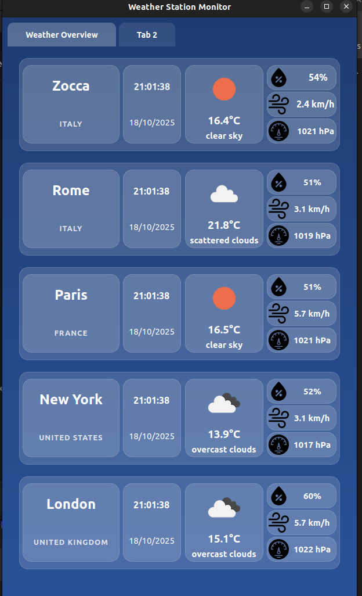
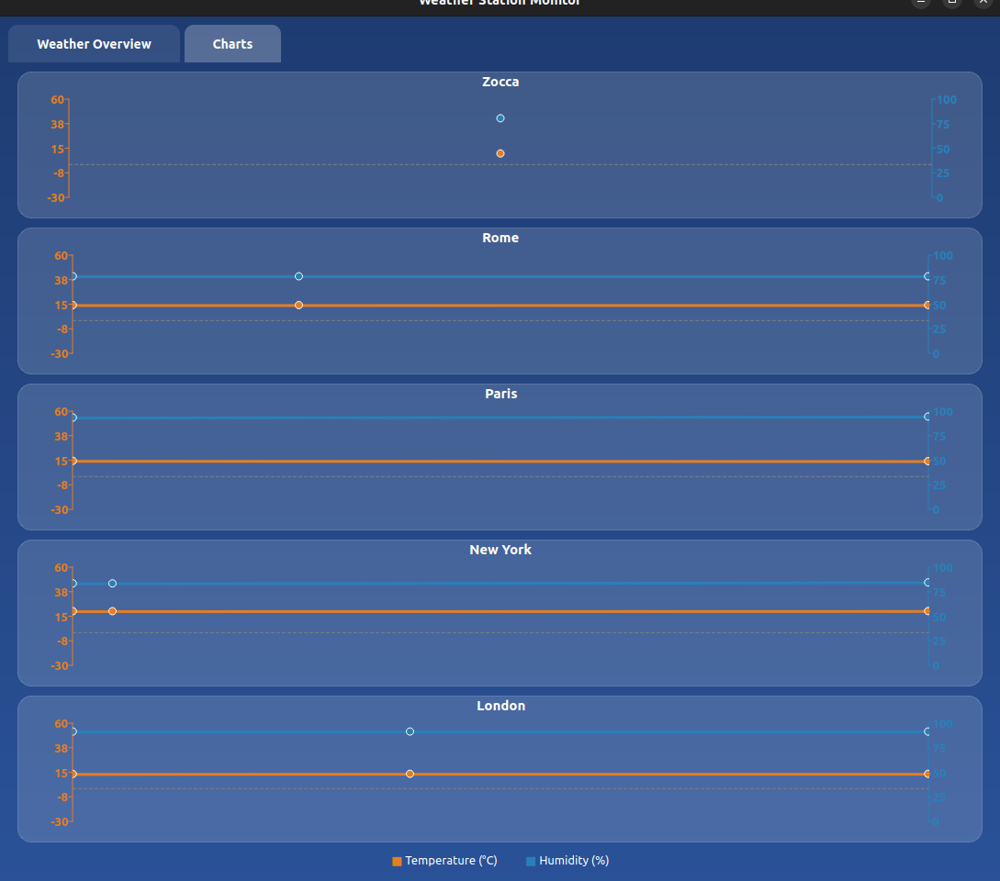

# Weather Station Monitor

<div align="center">

**Real-time weather monitoring for multiple cities with beautiful charts and analytics**


</div>

## Overview

Weather Station Monitor is a professional desktop application that provides real-time weather monitoring for multiple cities worldwide. Built with Qt5 and powered by OpenWeatherMap API, it offers beautiful visualizations, historical data tracking, and Python-powered analytics.

### Key Features

- **Multi-City Monitoring** - Track 5 cities simultaneously (Zocca, Rome, Paris, London, New York)
- **Real-Time Updates** - Automatic data refresh every 5 minutes
- **Interactive Charts** - Beautiful temperature and humidity charts with historical data
- **Comprehensive Data** - Temperature, humidity, pressure, wind speed/direction, visibility
- **Python Analytics** - Automatic calculation of averages and statistics
- **Database Persistence** - MySQL backend for reliable data storage
- **Modern UI** - Clean Qt5-based interface with weather icons
- **Multi-Threaded** - Concurrent API calls for fast data fetching

---

## Screenshots




---

## Installation

### Quick Install (Ubuntu/Debian)

```bash
# Download the .deb package
# Install it
sudo dpkg -i weather-station-monitor_1.0.0_amd64.deb
sudo apt-get install -f

# Set up the database
sudo mysql -u root -p < /usr/share/weather-station-monitor/database/schema.sql

# Configure the application
sudo nano /etc/weather-station-monitor/config.json
# Add your database credentials and OpenWeatherMap API key

# Run the application
weather-station-monitor
```

### Detailed Installation

See [INSTALL.md](docs/INSTALL.md) for comprehensive installation instructions including:
- Building from source
- Database setup
- Configuration details
- Troubleshooting

---

## Quick Start

### 1. Get an API Key

1. Visit [OpenWeatherMap](https://openweathermap.org/api)
2. Create a free account
3. Generate an API key (Free tier: 1000 calls/day)

### 2. Configure the Application

Edit `/etc/weather-station-monitor/config.json` with your database credentials and OpenWeatherMap API key. See the [Configuration](#configuration) section below for full options and examples.

### 3. Launch

From terminal:
```bash
weather-station-monitor
```

Or find it in your application menu under "Science" or search for "Weather Station Monitor"

---

## Usage

### Main Window

The application displays:
- **Real-time data** for 5 cities in individual panels
- **Temperature** (°C), **Humidity** (%), **Pressure** (hPa)
- **Wind** speed and direction
- **Weather conditions** with descriptive icons
- **Sunrise/Sunset** times

### Charts

Each city has two interactive charts:
- **Temperature Chart** - Historical temperature data with trend line
- **Humidity Chart** - Historical humidity data

Charts automatically update as new data arrives.

### Auto-Refresh

The application automatically fetches new data every 5 minutes. You can see the last update time in the status bar.

---

## Architecture

### Technology Stack

- **Frontend:** Qt 5.15 (C++)
- **Backend:** MySQL 8.0
- **Analytics:** Python 3.10 (NumPy, Pandas)
- **API:** OpenWeatherMap REST API
- **Build System:** CMake
- **Packaging:** Debian (.deb)

### Components

```
┌─────────────────────────────────────────┐
│         Qt5 GUI (MainWindow)            │
├─────────────────────────────────────────┤
│   ThreadManager (Multi-threaded API)   │
├─────────────────────────────────────────┤
│  DatabaseManager  │  PythonBridge      │
├─────────────────────────────────────────┤
│      MySQL DB     │  Python Analytics  │
└─────────────────────────────────────────┘
```

---

## Configuration

### Config File Location

- **System-wide:** `/etc/weather-station-monitor/config.json`
- **Example:** `/usr/share/weather-station-monitor/config/example_config.json`

### Configuration Options

```json
{
  "Database": {
    "host": "localhost",        // MySQL host
    "name": "weather_station_db", // Database name
    "user": "your_user",         // MySQL username
    "password": "your_password"  // MySQL password
  },
  "WeatherAPI": {
    "base_url": "https://api.openweathermap.org/data/2.5",
    "api_key": "your_key",       // OpenWeatherMap API key
    "timeout": 10000,            // Request timeout (ms)
    "fetch_interval_ms": 300000, // Auto-refresh interval (5 min)
    "locations": {
      // Predefined cities with coordinates
    }
  }
}
```

---

## Development

### Building from Source

```bash
# Install dependencies
sudo apt-get install qtbase5-dev qtcharts5-dev python3-dev cmake

# Clone and build
git clone https://github.com/daopctn/WeatherStationMonitor.git
cd WeatherStationMonitor
./build-deb.sh
```

### Project Structure

```
WeatherStationMonitor/
├── src/              # C++ source files
├── include/          # Header files
├── ui/               # Qt Designer UI files
├── python/           # Python analytics scripts
├── resources/        # Icons and resources
├── database/         # SQL schema files
├── debian/           # Debian packaging files
└── docs/             # Documentation
```

### Dependencies

See [python/requirements.txt](python/requirements.txt) for Python dependencies.

---

## Contributing

Contributions are welcome! Please:
1. Fork the repository
2. Create a feature branch
3. Make your changes
4. Submit a pull request

---

## Troubleshooting

### Common Issues

**Database connection fails:**
- Check MySQL is running: `sudo systemctl status mysql`
- Verify credentials in config file
- Ensure database exists: `sudo mysql -e "SHOW DATABASES;"`

**API calls fail:**
- Verify API key is active (may take 1-2 hours for new keys)
- Check internet connection
- Test API manually with curl

**Application won't start:**
- Check dependencies: `dpkg -l | grep weather-station-monitor`
- Run from terminal to see error messages
- Check Qt installation

See [INSTALL.md](docs/INSTALL.md) for detailed troubleshooting.

---

## License

This project is licensed under the MIT License - see the [LICENSE](LICENSE) file for details.

---

## Acknowledgments

- Weather data provided by [OpenWeatherMap](https://openweathermap.org/)
- Weather icons from OpenWeatherMap
- Built with [Qt Framework](https://www.qt.io/)

---

## Support

- **Documentation:** [INSTALL.md](docs/INSTALL.md)
- **Issues:** [GitHub Issues](https://github.com/daopctn/WeatherStationMonitor/issues)
- **Email:** daopctn@gmail.com

---

<div align="center">

Made with ❤️ using Qt, Python, and MySQL

</div>
